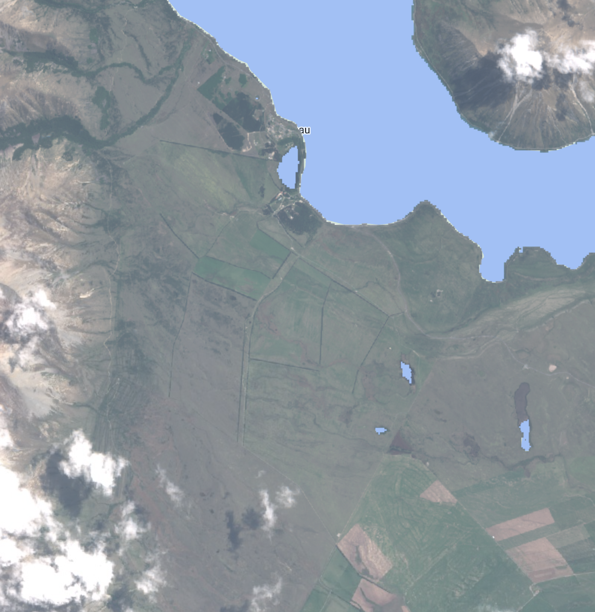
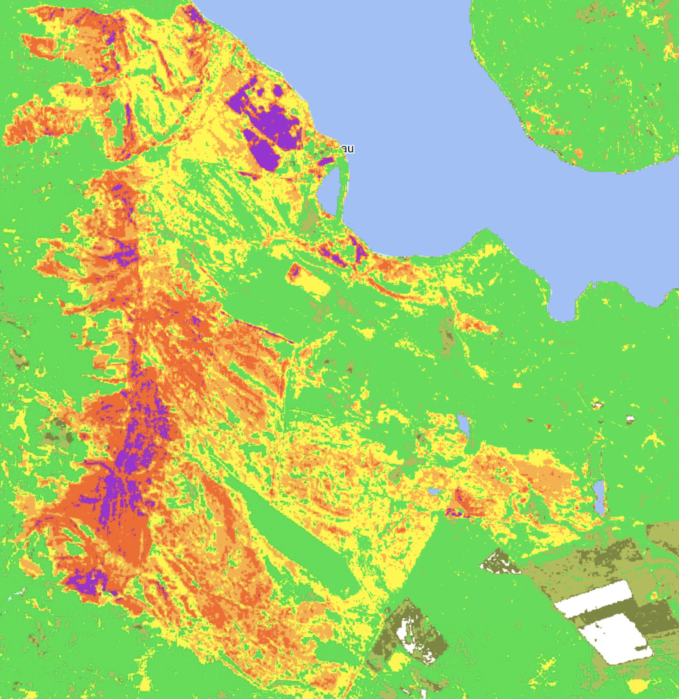

# Wildfire Burn Severity Mapping

Project to map wildfire with Sentinel-2 and Landsat-8 images in New
Zealand.

## Project Description

This repository contains code written in Google Earth Engine (GEE) for
analyzing Sentinel-2 and Landsat-8 satellite images to map burn severity
using the Normalized Burn Ratio (NBR). The purpose of this code is to
assess the wildfire that occurred at Lake Ohau in New Zealand, which
started on 4th October 2020 and lasted for approximately 9 days.

## Workflow Overview

The workflow follows the following steps:

1\. Data Acquisition: Retrieve Sentinel-2 and Landsat-8 satellite images
covering the timeframe of the wildfire.

2\. Preprocessing: Apply necessary corrections and cloud masking
techniques to ensure accurate analysis.

3\. Calculation of NBR: Compute the Normalized Burn Ratio using the
pre-fire and post-fire satellite images.

4\. Burn Severity Mapping: Classify the burn severity levels based on
the NBR values and generate a burn severity map.

5\. Visualization: Display the resulting burn severity map along with
relevant spatial information.

| Sentinel-2 image pre-fire season:                        | Burn severity map post-fire season::               |
|----------------------------------------------------------|----------------------------------------------------|
| {width="295"} | {width="295"} |

## Disclaimer

Please note that this code serves as a starting point for analyzing burn
severity using Sentinel-2 and Landsat-8 images. It may require further
customization and adaptation based on your specific study area and
objectives. Use the code at your own discretion, and ensure to comply
with the terms and conditions of the data providers.

## References

Include any relevant references, datasets, or papers used in the
analysis, if applicable.

## Files and data description

Overview of the most important files and data present in the root
directory:

-   Folders:
    -   `results`: Contains the analysis result for the Lake Ohau
        wildfire in New Zealand.
-   Files:
    -   `datasheet.md` : Description of the input data.
    -   `burn_severity_mapping.js`: Main workflow for the NBR analysis.
    -   `cloud_masking.js`: A library of functions (cloud masking) used
        in the main workflow.

The project repository has the following structure:

    .
    ├── burn_severity_mapping.js   --------> This file contains the main workflow for NBR mapping
    ├── cloud_masking.js    --------> Functions for BRDF corrections and cloud masking 
    ├── results
    │   └── dNBR.tif   ------> NBR analysis result (burn severity mapping) in *.tif format
    ├── README.md

## Usage

To use this code, follow these steps:

1\. Clone this repository or download the code files.

2\. Open the Google Earth Engine platform and create a new script.

3\. Copy and paste the code into the GEE script editor.

4\. Modify the code parameters, such as the study area, dates, and
satellite image collections, as per your requirements.

5\. Run the code in Google Earth Engine and observe the generated burn
severity map.

## **Run unit tests**

Not implemented.

## Dependencies

Code runs completely within Google Earth Engine.
